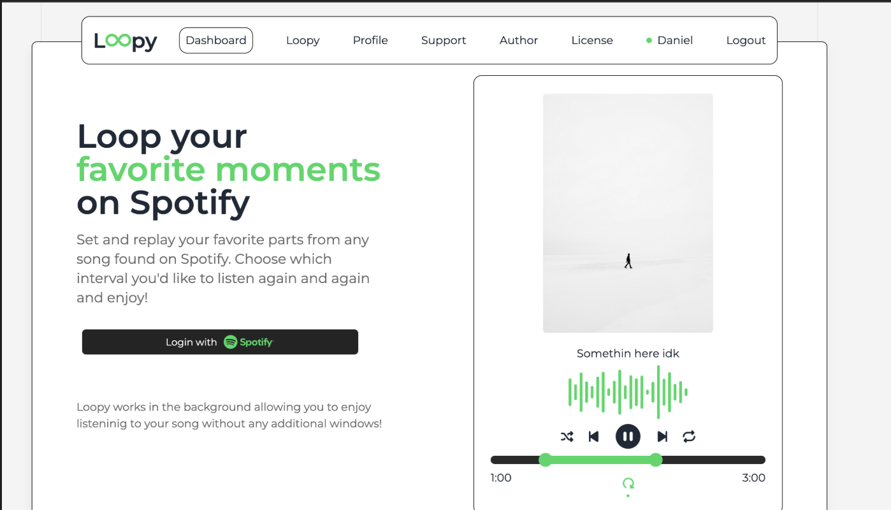
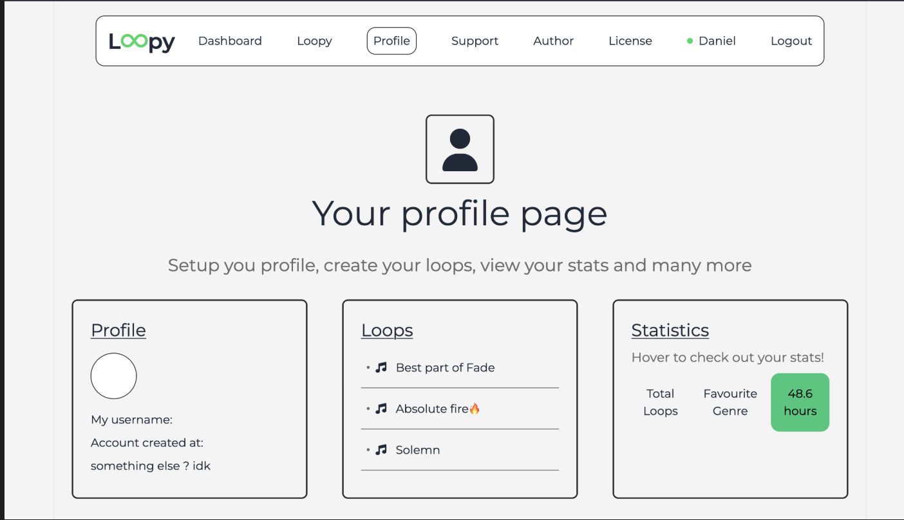
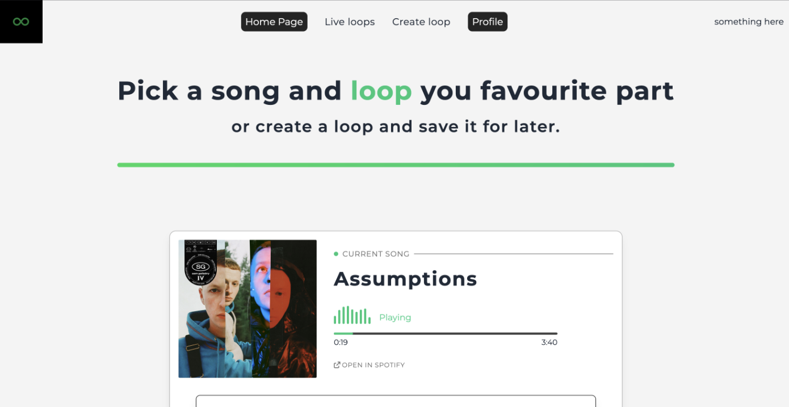
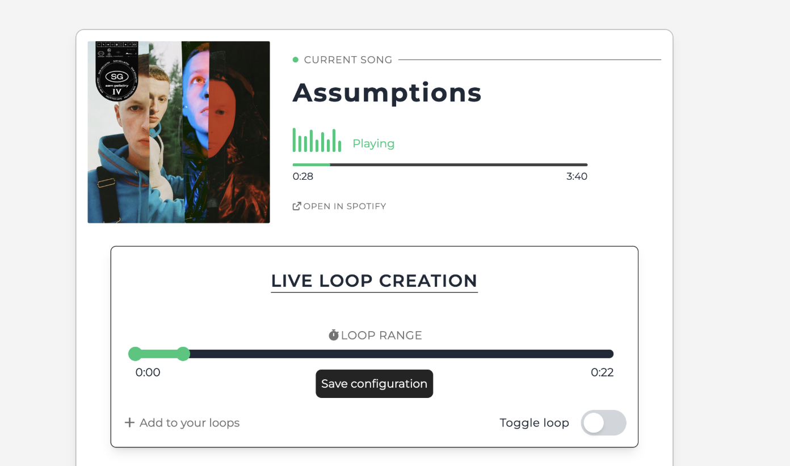

# Loopy

Loopy is a full-stack Spotify companion app for replaying the best part of a song without touching the progress bar over and over again.

The app connects to a user's Spotify account, reads the current playback state, lets the user choose a track segment, and keeps that interval looping in real time. It is built as a React frontend backed by a Spring Boot API that handles Spotify OAuth, playback requests, playlist data, and user persistence.

## Screenshots

### Landing page


### Profile section


### Loopy page


### Song and loop panel


## What it does

- Sign in with Spotify using OAuth2
- Read the user's current playback state
- Browse Spotify playlist and track data
- Pick a section of a song and loop it
- Store Spotify user information in PostgreSQL
- Keep frontend auth state and redirects smooth after login
- Separate Spotify API access from the domain and controller layers

## Tech stack

### Frontend

- React
- TypeScript
- Vite
- React Router
- Context API and custom hooks
- Tailwind CSS

### Backend

- Java 21
- Spring Boot 3
- Spring Security OAuth2 Client
- Spring WebFlux `WebClient`
- Spring Data JPA
- PostgreSQL

## Architecture

Loopy is split into three main parts:

- `frontend/` is the Vite React application. It owns the UI, routing, auth redirects, and calls the backend API.
- `backend/` is the Spring Boot service. It owns Spotify OAuth, session security, user persistence, and Spotify Web API integration.
- PostgreSQL stores application user data linked to Spotify accounts.

The frontend calls the backend at `http://127.0.0.1:8080`. The backend redirects users to Spotify for login, receives the OAuth callback, creates a session, and then redirects the browser back to the frontend at `http://127.0.0.1:5173/callback`.

## Local startup

These steps are the most important part of the setup. Spotify OAuth redirect URLs must match exactly, including the host, port, and protocol.

### 1. Prerequisites

Install:

- Java 21
- Node.js 24 or a recent compatible Node version
- npm
- PostgreSQL
- A Spotify Developer application

Spotify playback control also needs an active Spotify player. Some playback-control endpoints require a Spotify Premium account.

### 2. Create the database

Create a local PostgreSQL database named:

```bash
spotify_macros
```

The default local backend config expects PostgreSQL on:

```text
jdbc:postgresql://localhost:5432/spotify_macros
```

Then add your database username and password in:

```text
backend/src/main/resources/application-local.yml
```

### 3. Configure Spotify

In the Spotify Developer Dashboard, create an app and add this redirect URI:

```text
http://127.0.0.1:8080/login/oauth2/code/spotify
```

Use `127.0.0.1`, not `localhost`, when launching the frontend. The frontend and backend are configured around `127.0.0.1`, and mixing hosts can break cookies or redirect handling.

Export your Spotify credentials before starting the backend:

```bash
export SPOTIFY_CLIENT_ID="your-client-id"
export SPOTIFY_CLIENT_SECRET="your-client-secret"
```

### 4. Start the backend

From the backend directory:

```bash
cd backend
./mvnw spring-boot:run
```

The backend runs on:

```text
http://127.0.0.1:8080
```

### 5. Start the frontend

In another terminal:

```bash
cd frontend
npm install
npm run dev
```

Open:

```text
http://127.0.0.1:5173
```

### Redirect checklist

If login redirects fail, check these first:

- The Spotify redirect URI is exactly `http://127.0.0.1:8080/login/oauth2/code/spotify`.
- The frontend is opened at `http://127.0.0.1:5173`, not `http://localhost:5173`.
- The backend is running on port `8080`.
- `SPOTIFY_CLIENT_ID` and `SPOTIFY_CLIENT_SECRET` are set in the backend terminal.
- PostgreSQL is running and the `spotify_macros` database exists.
- The browser is not blocking the local session cookie.

## API and auth flow

1. The user clicks login in the React app.
2. The browser is sent to `http://127.0.0.1:8080/oauth2/authorization/spotify`.
3. Spring Security redirects to Spotify.
4. Spotify redirects back to `http://127.0.0.1:8080/login/oauth2/code/spotify`.
5. The backend creates the session and sends the browser to `http://127.0.0.1:5173/callback`.
6. The frontend restores the page the user originally tried to visit.

## Project structure

```text
.
|-- backend/
|   |-- src/main/java/com/api/          # REST controllers
|   |-- src/main/java/com/config/       # Security, CORS, Spotify WebClient config
|   |-- src/main/java/com/domain/       # Domain models and services
|   |-- src/main/java/com/security/     # Auth helpers and token storage
|   |-- src/main/java/com/spotify/      # Spotify API client and DTOs
|   `-- src/main/resources/             # Spring application config
|-- frontend/
|   |-- src/api/                        # Backend API calls
|   |-- src/components/                 # UI components
|   |-- src/context/                    # React contexts
|   |-- src/providers/                  # App providers
|   |-- src/route/                      # Protected routing
|   `-- src/types/                      # TypeScript models
`-- screenshots/                        # README images
```

## Build

Build the backend:

```bash
cd backend
./mvnw clean package
```

Build the frontend:

```bash
cd frontend
npm run build
```

## Notes

Dockerfiles are included for the frontend and backend, and the project was designed with container deployment in mind. Kubernetes deployment files can be added or revisited later, but the current README focuses on getting the application running locally without OAuth redirect problems.
